# 准备工作
1. 按照README.md, 进行配置
2. 下载数据集，文件夹改名为raw_data，路径为data/raw_data/pos和data/raw_data/pos
3. 执行prepare.py进行数据的预处理，raw2jpg()将原始图像统一为RGB格式，jpg2tensor()将jpg转成tensor格式，并保证图片tensor大小[3, H, W]为三通道
4. 以cgan.py为例，我用data/cup_plus/dataset.py里的Cup类定义了奖杯数据集，人工指定了label，可参照该格式进行改写
5. 其他操作详见README.md，需要注意的是我改了项目结构，这是为了能顺利导入Cup类

关于cup_plus
1. pos类去除了奇形怪状的，黑色背景的，歪的，非居中的，重复的奖杯（高质量）
2. 图像分辨率较高，需要选择合适的预处理，改进网络结构（高分辨率）

傻瓜式
1. 下数据集, 名字改成raw_data
2. 预处理
   自己电脑的内存不够，因此对数据集做一个resize，顺便统一下分辨率
```
python
cd data/cup_plus
python3 prepare.py
cd ../../
```
1. 训练
```
python
python3 wgan.py
```

#WGAN炼丹心得

##train1
使用默认的超参数，数据集分辨率统一为128*128，训练1000轮，但随着训练轮次的增大效果反而变差。

##train2
发现生成器最后的tanh层会把像素限制到[-1,1], 遂将生成器最后的tanh层删除，减小lr为0.00002，batch_size为8，生成分辨率为64*64，训练1000轮，取得了不错的效果。 

####训练结果  
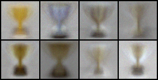

##train3
本次尝试大训练轮次，并减小生成图片的分辨率到32*32，试试量变能否引起质变，结果效果比前几次训练都要好，奖杯的轮廓逐渐清晰，奖杯的形状也比较多样，
但是在训练到8000轮次左右时，生成图像的质量趋近稳定，猜测此时模型已经接近收敛，判别器的损失函数值在[-1,1]范围振荡，生成器的损失函数在[-10,10]范围振荡，
此时图像虽然逐步成形，但依旧比较模糊。
此外生成器会尝试变化亮度以欺骗判别器，我认为这可能会妨碍生成器生成奖杯的多样性，所以是否可以对生成图片的亮度做一个限制？或者使用HSI模型训练？

####训练结果(1w~13w batch)  

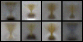
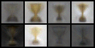
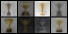
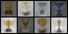

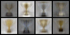
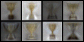
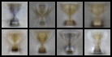
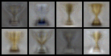

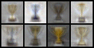
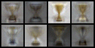
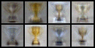
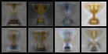


####超参数  
```
parser.add_argument("--n_epochs", type=int, default=10000, help="number of epochs of training")
parser.add_argument("--batch_size", type=int, default=8, help="size of the batches")
parser.add_argument("--lr", type=float, default=0.00002, help="learning rate")
parser.add_argument("--n_cpu", type=int, default=8, help="number of cpu threads to use during batch generation")
parser.add_argument("--latent_dim", type=int, default=512, help="dimensionality of the latent space")
parser.add_argument("--img_size", type=int, default=32, help="size of each image dimension")
parser.add_argument("--channels", type=int, default=3, help="number of image channels")
parser.add_argument("--n_critic", type=int, default=5, help="number of training steps for discriminator per iter")
parser.add_argument("--clip_value", type=float, default=0.01, help="lower and upper clip value for disc. weights")
parser.add_argument("--sample_interval", type=int, default=10000, help="interval between image samples")
```  

##train4
第三次训练似乎证明"大力出奇迹"，于是本次训练继续加大轮次至2W，并调整生成分辨率为64*64，尝试生成更清晰的图像，其他参数不变，跑了一晚上，没想到在20000批和200000批生成的图像质量居然没什么差别，甚至还更差了。  

####训练结果
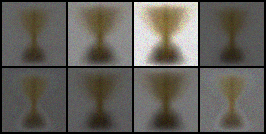  
20000 batch

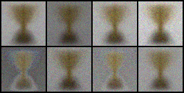  
2330000 batch

猜测有可能的原因：  
1. 潜在空间维度过小
2. 学习率太大
3. 

####超参数  
```
parser.add_argument("--n_epochs", type=int, default=20000, help="number of epochs of training")
parser.add_argument("--batch_size", type=int, default=8, help="size of the batches")
parser.add_argument("--lr", type=float, default=0.00002, help="learning rate")
parser.add_argument("--n_cpu", type=int, default=8, help="number of cpu threads to use during batch generation")
parser.add_argument("--latent_dim", type=int, default=512, help="dimensionality of the latent space")
parser.add_argument("--img_size", type=int, default=64, help="size of each image dimension")
parser.add_argument("--channels", type=int, default=3, help="number of image channels")
parser.add_argument("--n_critic", type=int, default=5, help="number of training steps for discriminator per iter")
parser.add_argument("--clip_value", type=float, default=0.01, help="lower and upper clip value for disc. weights")
parser.add_argument("--sample_interval", type=int, default=10000, help="interval between image samples")
```  

   
